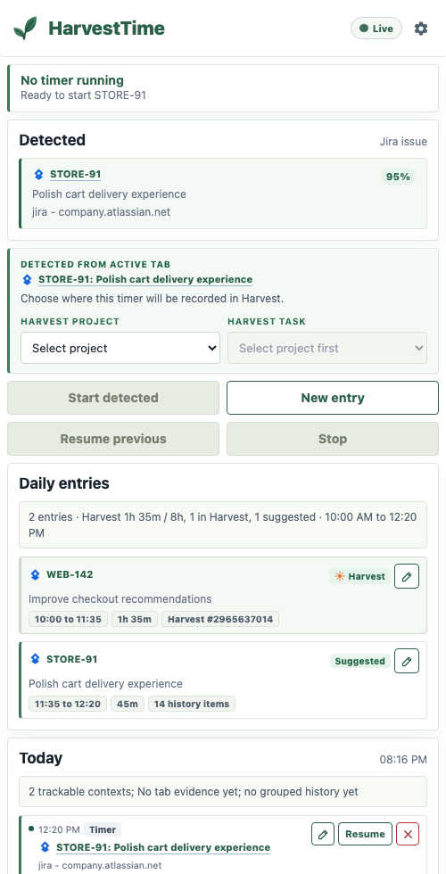
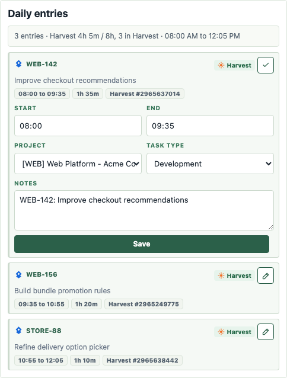
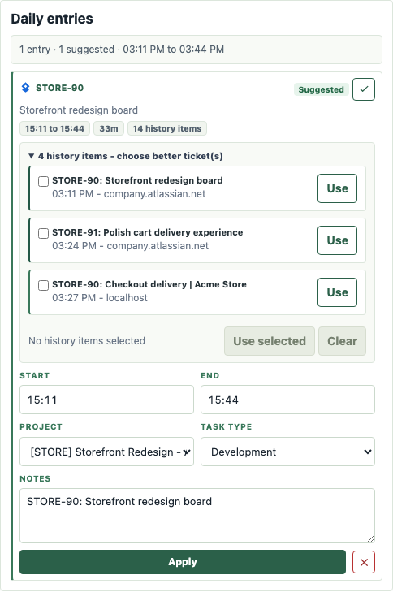
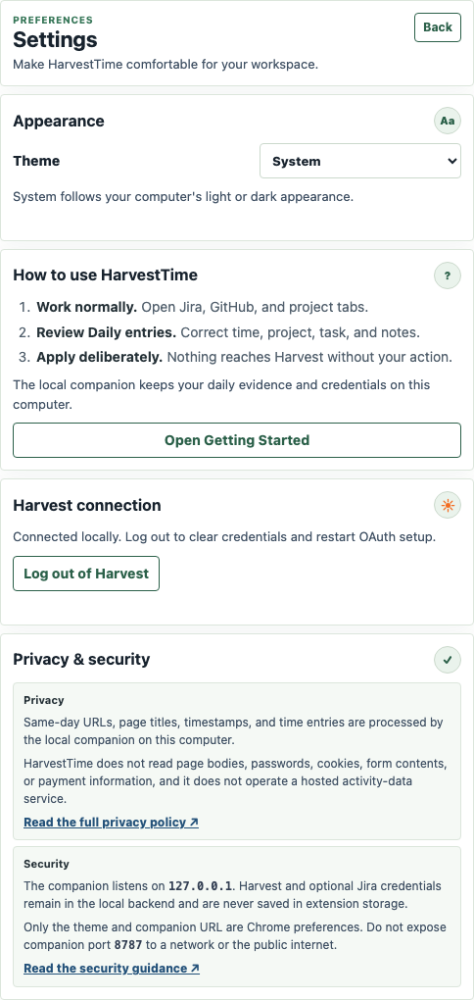
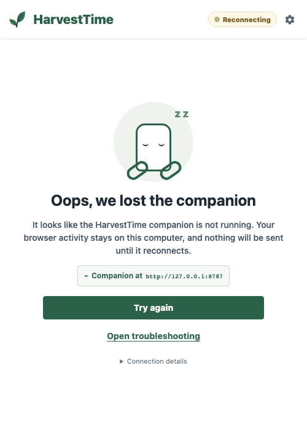
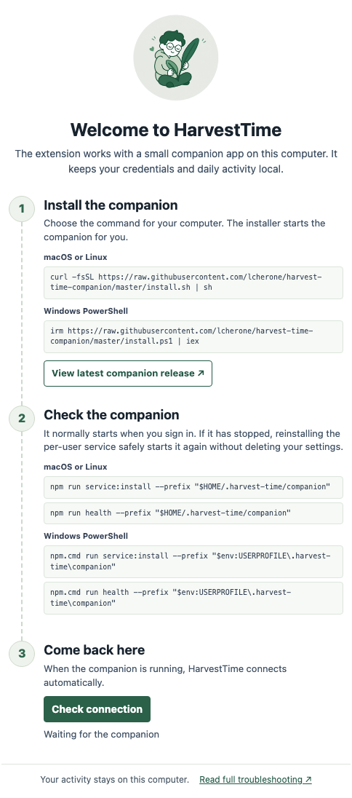

# HarvestTime Companion

> **The private, local engine that turns browser context into a reviewable Harvest workday.**

HarvestTime Companion is a small Node.js service used by the HarvestTime Chrome extension. It owns
durable daily state, keeps Harvest credentials out of the browser, reconciles timers with Harvest,
and turns approved browser evidence into useful Daily entry suggestions.

You install it once. It starts when you sign in, runs quietly in the background, and listens only
on `127.0.0.1:8787` by default. There is no HarvestTime activity-data cloud and no terminal window
that must remain open.

<p align="center">
  
</p>

## Contents

- [Why the companion runs locally](#why-a-local-nodejs-companion)
- [Review the architecture and quality model](#lightweight-by-design-thoroughly-tested)
- [Read the privacy and security promise](#privacy-security-and-a-free-forever-promise)
- [Install the companion](#one-time-installation)
- [Connect Harvest and Jira](#connect-a-harvest-account)
- [Operate and update it](#normal-day-to-day-operation)
- [Troubleshoot or uninstall](#troubleshooting)

## Why a local Node.js companion?

A browser extension is excellent at presenting a focused side panel and collecting the context you
approve. It is deliberately not the right place for long-lived API credentials, filesystem-backed
daily state, or reliable background reconciliation.

The companion supplies those capabilities without sending your work history to somebody else’s
server:

| Local capability             | Why it matters                                                                                                      |
| ---------------------------- | ------------------------------------------------------------------------------------------------------------------- |
| **Credential isolation**     | Harvest OAuth/PAT and optional Jira credentials never need to live in Chrome sync storage.                          |
| **Durable workday state**    | Suggestions, manual entries, dismissed noise, timer history, and resume targets survive panel and browser restarts. |
| **Harvest reconciliation**   | Running, edited, restarted, stopped, and deleted Harvest entries are reflected back into the side panel.            |
| **Resilient live reads**     | Account- and query-scoped snapshots keep task choices and today’s entries usable through brief transient failures.  |
| **Review generation**        | Same-day evidence becomes ticket-sized suggestions rather than a raw URL log.                                       |
| **Background operation**     | A per-user service starts at login and updates safely without an open terminal.                                     |
| **Inspectable installation** | It is an ordinary local checkout with documented npm commands, local files, policies, and an uninstall path.        |

## Lightweight by design, thoroughly tested

The companion is intentionally a small, inspectable Node.js application. It uses Fastify for the
local HTTP boundary, Zod for shared runtime contracts, and plain TypeScript modules for services,
storage, and integrations. The extension uses browser-native DOM APIs rather than a heavy frontend
framework. There is no Electron shell, hosted dashboard, analytics runtime, or always-connected
HarvestTime cloud process competing for memory. The result is quick to start, modest in resource
use, and straightforward for a web developer to audit.

Reliability is protected at several levels:

- unit tests cover shared contracts, configuration, context detection, stores, timer adapters, and
  Harvest/Jira integrations;
- cache tests cover account/query isolation, corrupt-file recovery, transient Harvest failures,
  authentication boundaries, and the prohibition on substituting cached data for failed writes;
- injected-client route tests exercise authentication, validation, setup, timer, review, timeline,
  and Harvest actions without using real credentials or the public network;
- Playwright tests the compiled extension and its user-visible actions in Chromium, including
  stopped/running states, settings, themes, time inputs, suggestions, links, recovery, and failures;
- the distribution is rebuilt from the production API, installed from its lockfile in isolation,
  started on a temporary loopback port, and checked through its real health endpoint;
- CI enforces builds, TypeScript, linting, formatting, coverage thresholds, browser tests, companion
  parity, and distribution freshness.

This is defence-in-depth testing: contracts, backend behaviour, HTTP actions, rendered UI, and the
actual package people install all have explicit regression checks.

## Privacy, security, and a free-forever promise

HarvestTime will remain free to use. The project does not monetise browser activity,
timesheet content, credentials, or work patterns.

There is no HarvestTime telemetry, analytics SDK, advertising pixel, behavioural profiling, or
hosted activity-data service. Daily state and credentials stay on the user's machine. The
companion contacts only services needed for a user-configured feature: Harvest for explicit timer
and timesheet actions, Jira when optional verification is enabled, and the configured Git remote
when updates are requested or allowed. It never sends work-history data to the HarvestTime
maintainers or unrelated third parties.

Browser evidence cannot submit time or control a timer by itself. Network-facing actions remain
explicit, the service binds to `127.0.0.1` by default, tokens are kept out of Chrome sync storage,
and sensitive mutable files are excluded from Git.

## What it unlocks in the extension

### A reconstructed day you can actually review

The companion combines same-day browser metadata, active-ticket context, manual additions, and
existing Harvest entries into one Daily entries workflow.

<p align="center">
  
</p>

Every row has independent time, Harvest project, task type, and notes controls. Rows remain compact
while scanning the day, and one editor expands at a time; switching rows preserves in-progress
drafts. A developer can correct a suggestion; a designer can move it to the right project; either
can remove unrelated noise before it reaches a timesheet.

Start and End fields are keyboard-friendly. Enter `12:30` directly, use shorthand such as `930`,
or leave End blank to create a running Harvest timer. Existing Harvest rows are protected from the
suggestion-removal action and update their remote entry instead of creating duplicates.

### Evidence without pretending every guess is perfect

<p align="center">
  
</p>

Broad contexts such as a Jira board or a local checkout flow can cover multiple tasks. The
companion retains compact evidence—timestamp, URL, title, host, and detected ticket context—so an
uncertain suggestion can be inspected, split into better entries, or dismissed.

It does **not** read page bodies, passwords, cookies, form contents, or payment information.

### Harvest-aware timer control

The companion owns explicit start, switch, stop, and resume transitions. Browser activity can
suggest context, but it cannot operate a timer by itself.

On each side-panel refresh, today’s Harvest list is treated as authoritative:

- remote note, mapping, and clock-time edits update the local row;
- a timer restarted in Harvest becomes the active local timer;
- stale stop events are removed after a restart;
- entries deleted in Harvest disappear locally;
- a transient network, rate-limit, timeout, or Harvest server failure may return the matching
  validated local read snapshot for task assignments or time entries;
- rejected credentials never fall back to cached data, and mutations always remain live—cached
  data can never claim that a create, update, or timer action succeeded.

### Optional Jira detail

Basic Jira-key and GitHub context detection is local. Optional Jira verification adds the canonical
summary, status, issue type, project, assignee, and browse URL. Jira failure is non-blocking: Daily
entries, local detection, timer operations, and Harvest submission continue to work.

### Plain-language privacy and recovery

<p align="center">
  
</p>

The extension explains what is processed and where credentials live. If the companion stops, the
normal work UI is replaced with a friendly reconnect screen instead of failing silently. A fresh
install sees Welcome and an in-panel Getting Started guide rather than a connection error.

<p align="center">
  
</p>

<p align="center">
  
</p>

## One-time installation

### Requirements

- [Node.js 22 or newer](https://nodejs.org/)
- Git
- The HarvestTime Chrome extension

The installer creates a local checkout, installs the exact locked dependencies with dependency
scripts disabled, registers a per-user background service, and starts it. Administrator access is
not required.

### macOS or Linux

```sh
curl -fsSL https://raw.githubusercontent.com/lcherone/harvest-time-companion/master/install.sh | sh
```

### Windows PowerShell

```powershell
irm https://raw.githubusercontent.com/lcherone/harvest-time-companion/master/install.ps1 | iex
```

Confirm it is ready:

```sh
npm run health --prefix "$HOME/.harvest-time/companion"
```

The response should identify `harvest-time-api` with status `ok`. The extension connects to
`http://127.0.0.1:8787` automatically.

## Prefer to inspect it first?

The one-line installer is optional. Clone the repository, inspect the scripts, install locked
dependencies, and register the service yourself:

```sh
git clone https://github.com/lcherone/harvest-time-companion.git
cd harvest-time-companion
npm ci --ignore-scripts
npm run service:install
npm run health
```

For foreground-only use without a login service or automatic updates:

```sh
npm run start
```

## How the pieces communicate

```text
Chrome extension
  ├─ renders the side panel
  ├─ collects approved active-tab and same-day history metadata
  └─ calls http://127.0.0.1:8787
       └─ HarvestTime Companion (Node.js + Fastify)
            ├─ stores local daily state
            ├─ generates and reconciles review entries
            ├─ calls the Harvest API
            └─ optionally verifies Jira issues
```

The loopback boundary is important: credentials and daily state stay in the companion, while the
extension receives only the product state it needs to render and act on.

## First run and mock mode

A clean extension install first opens Getting Started when it has not connected to the companion.
The guide includes the platform installers, service health commands, the latest-release link, and a
**Check connection** action. It remains available from Settings and from reconnect troubleshooting.

After the companion connects, a clean install starts in mock mode. No Harvest or Jira credentials
are required to understand the workflow. Mock mode uses local deterministic timer entries and is
safe for evaluation or Chrome Web Store review.

When you are ready for live time tracking, configure Harvest and explicitly choose the live setup
path in the extension.

When you need to disconnect later, Settings provides a confirmed **Log out of Harvest** action. It
clears locally managed OAuth/PAT credentials, the selected account, and the validated Harvest read
cache before returning the extension to Mock mode with OAuth setup available again. It never
deletes or edits remote Harvest entries.

## Connect a Harvest account

Copy the environment template:

```sh
cp .env.example .env
```

Create a Harvest OAuth application with this redirect URL:

```text
http://127.0.0.1:8787/auth/harvest/callback
```

Set the OAuth application details:

```sh
HARVEST_CLIENT_ID=...
HARVEST_CLIENT_SECRET=
HARVEST_USER_AGENT=Your App Name (you@example.com)
HARVEST_REDIRECT_URI=http://127.0.0.1:8787/auth/harvest/callback
```

Restart the service, choose **Connect with Harvest** in the extension, and select the Harvest
account. A personal access token remains available as a local fallback when OAuth is unavailable.

## Optional Jira enrichment

Add these values to `.env` only when verified Jira metadata is wanted:

```sh
JIRA_VERIFY_ISSUES=true
JIRA_SITE_URL=https://your-site.atlassian.net
JIRA_EMAIL=you@example.com
JIRA_API_TOKEN=
```

Detection still works without them. Jira is enrichment, not a runtime dependency.

## Normal day-to-day operation

There is normally nothing to manage:

- the service starts when you sign in;
- the extension discovers it on the loopback address;
- the companion checks for a safe fast-forward update every six hours;
- accepted updates install locked dependencies and restart the service;
- `.env`, credentials, and daily data remain local across updates.

Automatic updates stop safely when tracked files have local changes or the branch has diverged.
They do not overwrite a modified installation.

## Useful commands

Run these inside the companion directory, or use
`--prefix "$HOME/.harvest-time/companion"` from elsewhere.

| Command                     | Purpose                                                      |
| --------------------------- | ------------------------------------------------------------ |
| `npm run health`            | Check the local API and report whether it is ready.          |
| `npm run start`             | Run in the current terminal without automatic Git updates.   |
| `npm run start:auto`        | Run in the current terminal with the update supervisor.      |
| `npm run update:check`      | Check whether a safe fast-forward update is available.       |
| `npm run update`            | Apply the latest safe update immediately.                    |
| `npm run service:install`   | Install or refresh the per-user login service.               |
| `npm run service:uninstall` | Remove automatic startup while preserving settings and data. |
| `npm run smoke`             | Start an isolated instance and verify its health endpoint.   |

## Local files

| Data                                                               | Default location                           |
| ------------------------------------------------------------------ | ------------------------------------------ |
| Companion application                                              | `~/.harvest-time/companion/`               |
| Daily activity, review state, and validated Harvest read snapshots | `~/.harvest-time/companion/apps/api/data/` |
| OAuth token store                                                  | `~/.harvest-time/companion/.harvest-time/` |
| Optional environment settings                                      | `~/.harvest-time/companion/.env`           |

All sensitive and mutable files are excluded from Git.

## Troubleshooting

### The extension says the companion is not running

```sh
npm run health --prefix "$HOME/.harvest-time/companion"
npm run service:install --prefix "$HOME/.harvest-time/companion"
```

Confirm another process is not using port `8787` and that the service remains bound to
`127.0.0.1`.

### Harvest and the side panel differ

Bring the side panel into focus or wait for its refresh cycle. The companion fetches an
authoritative snapshot of today’s Harvest entries and reconciles remote edits, restarts, and
deletions. If Harvest is temporarily unavailable for a transient reason, the exact account/query
read may use its last validated local snapshot. Authentication failures and all writes still fail
normally instead of being hidden by cached data.

### An update is refused

Run `npm run update:check`. Updates are intentionally blocked when tracked files are modified or
the branch cannot be fast-forwarded. Preserve intentional edits, return the checkout to a clean
state, or update it manually after inspection.

## Uninstall or remove automatic startup

```sh
npm run service:uninstall --prefix "$HOME/.harvest-time/companion"
```

This removes the background-service registration but does not silently delete settings or daily
data. Inspect and remove `~/.harvest-time/companion` yourself if complete deletion is wanted.

## Privacy and security

The service is intended to remain bound to `127.0.0.1`. Do not expose port `8787` to a LAN or the
public internet.

- Read [PRIVACY.md](PRIVACY.md) for the complete data-handling description.
- Read [SECURITY.md](SECURITY.md) for deployment and credential guidance.
- Chrome Web Store reviewers can use [REVIEWER-INSTRUCTIONS.md](REVIEWER-INSTRUCTIONS.md).
